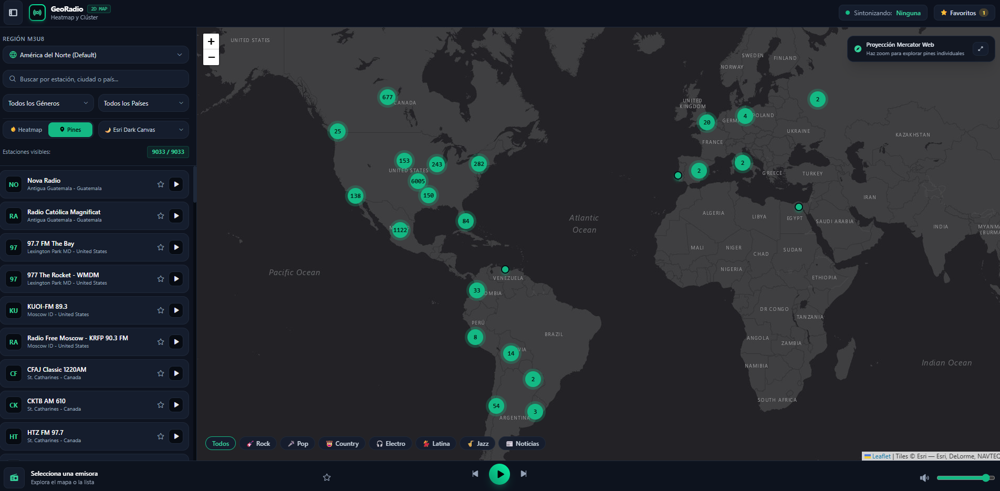

# 📻 GeoRadio Global Player (2D Mercator Map & Heatmap)

Reproductor cartográfico e interactivo de radio en streaming para explorar más de 38,000 estaciones del catálogo global de **Radio Garden** sobre una proyección plana **Web Mercator (EPSG:3857)** con mapa base oscuro de alta resolución y visualización en mapa de calor.

[-0d9488?style=for-the-badge)](https://server.arcgisonline.com)

---

## 🗺️ Vista Previa de la Aplicación

Haz clic en la imagen para abrir la aplicación web directamente en tu navegador:

  

  👉 <b><a href="https://samhithub.github.io/radiogarden_mediaplayer/">https://samhithub.github.io/radiogarden_mediaplayer/</a></b>

---

## ✨ Características Principales

- 🌙 **Mapa Base Oscuro por Defecto (100% Libre - Sin API Key):** Incorpora **Esri World Dark Canvas**, eliminando marcas de agua y limitaciones de tokens. Permite alternar a Esri Satélite, OpenStreetMap y Esri Topográfico con un solo clic.
- 🌎 **Carga Inicial Optimizada:** Inicia por defecto en la región de **América del Norte** con encuadre espacial inmediato en el continente, optimizando el rendimiento y los tiempos de renderizado.
- 🗺️ **Proyección Cartográfica Web Mercator (EPSG:3857):** Navegación plana bidimensional fluida sin distorsiones esféricas ni sobrecarga de GPU.
- 🔥 **Modo Heatmap Dinámico:** Visualiza la densidad de transmisión de estaciones a nivel global en tiempo real mediante mapas de calor (`leaflet-heat`).
- 📍 **Clustering Inteligente de Pines:** Agrupación espacial (`leaflet.markercluster`) que expande pines individuales y tarjetas emergentes interactivas con reproducción instantánea al hacer zoom.
- 🎸 **Filtro Inteligente de Géneros y Búsqueda en Vivo:** Selector desplegable y cinta de accesos rápidos sobre el mapa (*Rock, Pop, Electrónica, Jazz, Latina, Clásica, Country, Noticias, etc.*) sincronizados con el buscador en tiempo real.
- 🔊 **Consola de Audio Avanzada:** Soporte para transmisiones HLS (`hls.js`) y streams directos MP3/AAC de Radio Garden, con ecualizador animado, control de volumen y guardado de ⭐ **Favoritos** persistente en `localStorage`.
- 📱 **Soporte MediaSession API:** Controla pistas y visualiza información de la emisora en los controles multimedia de Windows, Android e iOS.

---

## 🚀 Guía Rápida de Uso

1. **Panel Lateral (Izquierda):**
   - **Región M3U8:** Cambia entre América del Norte, América del Sur, Europa, Asia, África, Oceanía o el catálogo completo.
   - **Buscador:** Escribe el nombre de la estación, ciudad o país.
   - **Filtros:** Combina selecciones por género musical y país.
   - **Lista Interactiva:** Haz clic en cualquier tarjeta para centrar el mapa y sintonizar la señal en vivo.
2. **Visor Mercator (Derecha):**
   - **Heatmap / Pines:** Alterna entre visualización de calor o clústeres de pines con los botones superiores de capa.
   - **Píldoras de Género:** Usa la cinta inferior sobre el mapa para filtrar rápidamente por estilo musical.
   - **Pines y Popups:** Haz clic en cualquier pin para ver el logotipo y reproducir la emisora.
3. **Reproductor (Barra Inferior):**
   - Controla play/pausa, emisora previa/siguiente, ajuste de volumen y marca estaciones como favoritas.

---

## 🎵 Enlaces M3U8 para VLC Media Player / Kodi / Reproductores IPTV

Para reproducir las listas segmentadas directamente en software de escritorio como **VLC** o **mpv**:

  
<b>▶ Haz clic aquí para ver los enlaces Raw directos (.m3u8)</b>

   

En VLC, presiona `Ctrl + N` (**Medio ➔ Abrir ubicación de red...**) y pega cualquiera de las siguientes URLs directas:

| Región | Enlace Raw Directo |
| :--- | :--- |
| 🌎 **América del Norte (Default)** | `https://raw.githubusercontent.com/SamHithub/radiogarden_mediaplayer/main/radios_america_del_norte.m3u8` |
| 🌎 **América del Sur** | `https://raw.githubusercontent.com/SamHithub/radiogarden_mediaplayer/main/radios_america_del_sur.m3u8` |
| 🌍 **Europa** | `https://raw.githubusercontent.com/SamHithub/radiogarden_mediaplayer/main/radios_europa.m3u8` |
| 🌏 **Asia** | `https://raw.githubusercontent.com/SamHithub/radiogarden_mediaplayer/main/radios_asia.m3u8` |
| 🌍 **África** | `https://raw.githubusercontent.com/SamHithub/radiogarden_mediaplayer/main/radios_africa.m3u8` |
| 🌏 **Oceanía** | `https://raw.githubusercontent.com/SamHithub/radiogarden_mediaplayer/main/radios_oceania.m3u8` |
| 🌐 **Otros / Sin clasificar** | `https://raw.githubusercontent.com/SamHithub/radiogarden_mediaplayer/main/radios_otros.m3u8` |
| 🌐 **Catálogo Global Completo (38,000+)** | `https://raw.githubusercontent.com/SamHithub/radiogarden_mediaplayer/main/radio_garden_global.m3u8` |

> *Nota: Todos los archivos M3U8 han sido sanitizados sin comas internas en los títulos para evitar recortes erróneos de nombres en el panel de reproducción de VLC.*

---

## 🛠️ Stack de Tecnologías

- **Leaflet 1.9.4** (Motor espacial 2D Web Mercator EPSG:3857).
- **Leaflet.heat** (Cálculo y renderizado de mapas de calor por densidad).
- **Leaflet.markercluster** (Agrupamiento jerárquico de marcadores espaciales).
- **Esri & OpenStreetMap Tile Services** (Capas base gratuitas y abiertas sin clave API).
- **Tailwind CSS** (Interfaz responsiva moderna en modo oscuro).
- **Hls.js** (Reproducción de streams HTTP Live Streaming).
- **Phosphor Icons** (Simbología vectorial de interfaz).
- **GitHub Pages** (Despliegue y distribución web global).

---

## 📄 Licencia

## ⚖️ Atribución, Derechos de Autor y Descargo de Responsabilidad

### 1. Atribución a Radio Garden
Este proyecto reconoce y agradece la labor de **[Radio Garden B.V.](https://radio.garden/)** (desarrollado originalmente junto al *Netherlands Institute for Sound and Vision*). 
- Los identificadores de canal, metadatos espaciales y el catálogo original de estaciones son propiedad intelectual y desarrollo de Radio Garden.
- Este software no tiene afiliación oficial, patrocinio ni respaldo directo por parte de Radio Garden.

### 2. Derechos de Transmisión de las Emisoras
- Ni este repositorio ni el reproductor web alojan, retransmiten, duplican ni distribuyen audio o contenido protegido por derechos de autor.
- Los logotipos, nombres comerciales y transmisiones en vivo son propiedad exclusiva de sus respectivas estaciones de radio y radiodifusores independientes.
- El archivo `.m3u8` y la aplicación funcionan exclusivamente como un indexador de hipervínculos que redirigen a los flujos de audio públicos emitidos libremente en la web por cada estación.

### 3. Propósito Educativo y No Comercial
- Este proyecto ha sido creado con fines exclusivamente didácticos, de investigación técnica en cartografía web (Web Mercator / GIS) y de uso personal.
- No contiene anuncios, pasarelas de pago ni ningún tipo de monetización directa o indirecta.

### 4. Política de Retiro (Takedown / DMCA)
Si usted es titular de derechos de autor, propietario de una estación de radio o representante de Radio Garden y considera que algún enlace o metadato indexado debe ser retirado o corregido, por favor abra un *Issue* en este repositorio o comuníquese a través de GitHub, y el contenido señalado será removido a la brevedad.

Distribuido bajo licencia [MIT](LICENSE).
